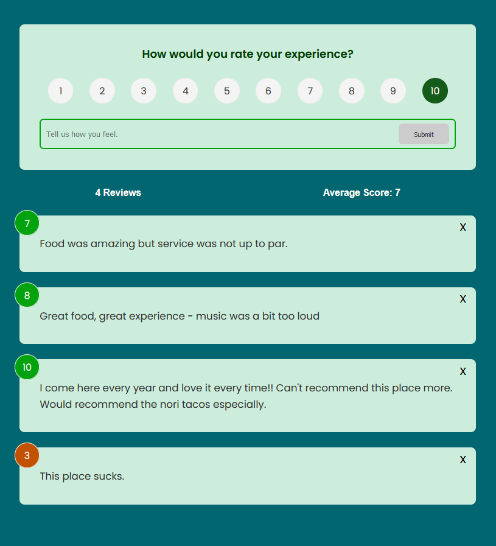
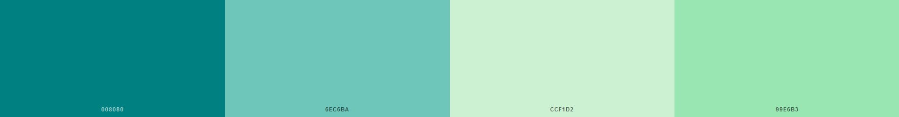

# Svelte Feedback Form

A feedback form made with Svelte (HTML, CSS, JavaScript). I made this as a personal project 20-21/10/2022.

This project was based on this YouTube tutorial by Traversy Media: https://www.youtube.com/watch?v=3TVy6GdtNuQ
I made sure to modify some elements and the colour palette but since I'm just getting started with Svelte it is quite similar.

## MVP:

-   Create a feedback form
-   Display feedback with rating
-   Ability to delete feedback
    -   this would not be ideal in a legitimate review context but since this project doesn't have a backend it is simply a basic demonstration of Svelte)
-   Ability to create new feedback
-   Number of reviews and average score displayed
-   Simple animations for reviews being created and deleted

## Colour scheme and styling

I really like working with ocean themes heavy with greens and teals. These are quite calming to me, so I regularly use them in my projects. I figured a calming atmosphere would be useful on a review website to encourage better reviews, so this styling seemed only natural.

Once I'd decided on this colour palette, I set about finding complementary colours, with the help of the below colour palette found on schemecolor.com. This was then slightly modified to fit what I had in mind for the project and imported into the \_palette.scss file accessible in the dev-assets folder for my reference. As this project uses CSS which is more useful for Svelte, these colours are referenced by their HEX codes in the individual elements.

I of course needed some more bright colours, particularly for the colours associated with the review (which change depending on the rating.)

### Responsiveness

This project needs more work in terms of responsiveness but it currently works down to about 510 px wide. The ideal settings are with a screen at least 730 px wide. I would like this to work on phones down to a width of 360 px (the width of the Galaxy S20 and narrower than the Galaxy Note 20 and the iPhone 11), so I will be modifying the SCSS in the near future to allow for this.

Note: it does technically work at this width but the rating numbers extend further than the box within which they are contained, which does not look appealing or polished.

## Next Steps for Svelte

-   A notepad app that works similarly to this one. This will be my opportunity to strike out on my own, albeit using this project as a base.
-   More usage of Svelte's inbuilt libraries
-   More usage of transitions

## To Run this Project

Feel free to download and run this project to test its functionality!

1. Navigate inside the folder "feedback-form" once you have downloaded the files.
2. Download the node modules with npm i inside this folder
3. Finally, just run it with the command npm run dev.
